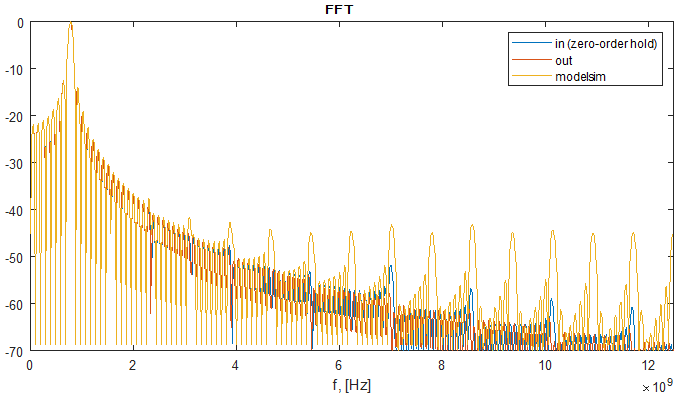

# Sine Wave Generator
This function is accomplished by means of trigonometric values stored in a LUT (ROM). Counters and comparators produce a quantized and sampled sinusoid.
______
## Quick start
- Create project in Modelsim
- Add .vhdl files
- Compile All
- Run do sim.do
- Run sin_osc_tb.m in Matlab
###### Output

